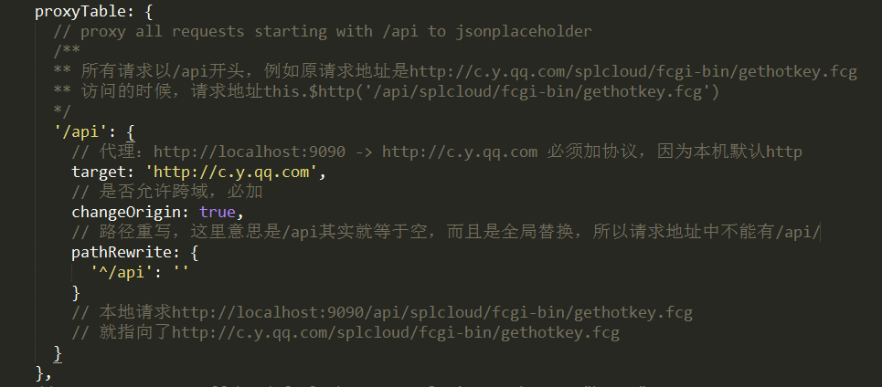
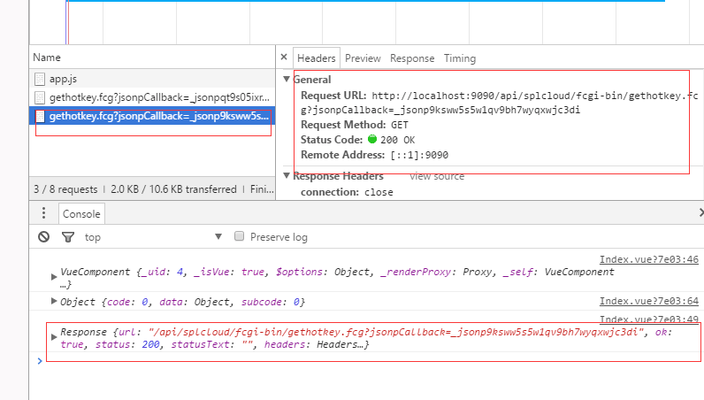

# 代理接口，这样可以避免开发环境中接口跨域的问题

项目启动默认是 http://localhost:8080

[Proxying During Development](https://vuejs-templates.github.io/webpack/proxy.html)

[http-proxy-middleware](https://github.com/chimurai/http-proxy-middleware)

# config/index.js 里：



# 结果:



# 调用：

``` js
// vue-resource
this.$http.jsonp('/api/splcloud/fcgi-bin/gethotkey.fcg', {
  jsonp: 'jsonpCallback'
}).then((response) => {
  console.log(response)
})
```

# 可以设置成

``` js
pathRewrite: {
  '^/api/search': '/splcloud/fcgi-bin/gethotkey.fcg'
}

this.$http.jsonp('/api/search', {
  jsonp: 'jsonpCallback'
}).then((response) => {
  console.log(response)
})
```
